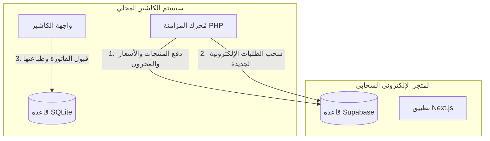

# 🌐 خطة ربط متجر الناصرية الإلكتروني مع سيستم الكاشير (POS)

يصف هذا المستند الخطة الكاملة والهيكل البرمجي لربط المتجر الإلكتروني (Next.js + Supabase) مع سيستم الكاشير المحلي (PHP + SQLite) لتحقيق المزامنة الكاملة والتحكم المطلق من الكاشير.

---

## 1. الهيكل العام للربط (System Architecture)

بما أن سيستم الكاشير يعمل محلياً في المتجر (Local Machine) على قاعدة بيانات SQLite، والمنصة الإلكترونية تعمل في السحاب (Supabase Cloud)، فإن **جهاز الكاشير المحلي سيكون هو المنسق الرئيسي وعقل المزامنة (Sync Coordinator)**. 
يرجع ذلك إلى أن خادم Supabase لا يمكنه إرسال طلبات HTTP مباشرة لجهاز محلي خلف جدار حماية (Firewall) بدون نفق مخصص، بينما يمكن لجهاز الكاشير المحلي إرسال طلبات سحابية لـ Supabase بكل سهولة.



---

## 2. تحديثات جداول قواعد البيانات (Schema Updates)

لتتبع السجلات والربط بين النظامين، نحتاج لإضافة حقول مرجعية كالتالي:

### أ. في قاعدة بيانات المتجر السحابي (Supabase):
نضيف حقل `pos_product_id` لربط السلعة بمثيلتها في الكاشير:
```sql
ALTER TABLE public.products ADD COLUMN pos_product_id INTEGER UNIQUE;
ALTER TABLE public.categories ADD COLUMN pos_category_id INTEGER UNIQUE;
```

### ب. في قاعدة بيانات الكاشير المحلي (SQLite):
نضيف حقل `supabase_order_id` لمعرفة الفواتير التي جاءت من الموقع وتجنب تكرارها:
```sql
ALTER TABLE sales_invoices ADD COLUMN supabase_order_id VARCHAR(80) UNIQUE;
```

---

## 3. خرائط مزامنة الجداول (Database Mapping)

### أ. مزامنة الأقسام (Categories)
| حقل الكاشير (SQLite) | حقل المتجر (Supabase) | طريقة المعالجة |
| :--- | :--- | :--- |
| `id` | `pos_category_id` | معرف الربط الرئيسي |
| `name` | `name` | الاسم بالعربية |
| - | `slug` | يتم إنشاؤه تلقائياً من الاسم |

### ب. مزامنة المنتجات والأسعار (Products & Prices)
| حقل الكاشير (SQLite) | حقل المتجر (Supabase) | طريقة المعالجة |
| :--- | :--- | :--- |
| `id` | `pos_product_id` | معرف الربط الرئيسي |
| `name` | `name` | اسم المنتج |
| `description` | `description` | وصف وتفاصيل الصنف |
| `sale_price` | `price` | السعر الأساسي للمستهلك |
| `wholesale_price` | `wholesale_price` | سعر الجملة للكرتونة/الشدة |
| `wholesale_min_qty` | `wholesale_min_qty` | الحد الأدنى لطلب الجملة |
| `stock` | `stock` | الرصيد الحالي بالمخزن |
| `is_active` | `is_available` | حالة العرض بالمتجر (متاح/مخفي) |

---

## 4. محاور المزامنة الثلاثة (Core Sync Flows)

### 🔄 المحور الأول: مزامنة المنتجات والأسعار (POS -> Web)
* **الميكانيكية**: في سيستم الكاشير، عند قيام مدير الفرع بإضافة منتج جديد، تعديل سعره، أو إيقاف تفعيله:
  1. يقوم كود الـ PHP في الكاشير (عند الحفظ) بإطلاق خطاف ويب (Webhook Hook).
  2. يقوم الكاشير بعمل اتصال مباشر مع Supabase REST API لتحديث بيانات المنتج السحابي المطابق لـ `pos_product_id`.

### 🔄 المحور الثاني: مزامنة المخزون الفورية (POS -> Web)
* **الميكانيكية**: المخزون الحقيقي هو مخزون المحل الفعلي. 
  1. عند إتمام عملية بيع للكاشير في المحل وطباعة الفاتورة، يُطلق الكاشير طلبًا سحابياً لتخفيض رصيد المنتج بالمتجر الإلكتروني بنفس الكمية المباعة.
  2. في حالة عمل تسوية جرد (Inventory Adjustment) في المحل، يتم دفع الرصيد الجديد فوراً لـ Supabase لضمان عدم بيع صنف نفذت كميته.

### 🔄 المحور الثالث: سحب ومعالجة الطلبات الإلكترونية (Web -> POS)
* **الميكانيكية**:
  1. يقوم محرك المزامنة في الكاشير بعمل استعلام (Long Polling) كل 60 ثانية لجلب أي طلبات جديدة بوضع `pending` من Supabase.
  2. يتم عرض الطلبات الإلكترونية في شاشة جديدة مخصصة في الكاشير.
  3. عند نقر الكاشير على **"قبول الطلب وتأكيده"**:
     * يتم إنشاء فاتورة مبيعات محلية في SQLite برقم مرجعي `supabase_order_id`.
     * يتم طباعة الفاتورة وبون التحضير تلقائياً لعمال الديليفري.
     * يتم تحديث حالة الطلب في Supabase السحابي إلى `preparing` (جاري التحضير) ثم `delivering` (جاري التوصيل).

---

## 5. واجهة الاستدعاء البرمجية (API Webhook Integration)

سنقوم بإعداد ملف كود PHP في الكاشير يسمى `app/Services/SupabaseSyncService.php` لإرسال البيانات السحابية لـ Supabase باستخدام الـ API Key الخاص بك:

```php
<?php
namespace App\Services;

class SupabaseSyncService {
    private static $url = 'https://wihdriufidvpdbtiqzxx.supabase.co/rest/v1';
    private static $apiKey = 'YOUR_SUPABASE_SERVICE_ROLE_KEY';

    public static function syncProductToWeb($posProduct) {
        $cleanImage = $posProduct['image_path'] ? $posProduct['image_path'] : '';
        
        $payload = [
            'pos_product_id' => (int)$posProduct['id'],
            'name' => $posProduct['name'],
            'description' => $posProduct['description'],
            'price' => (float)$posProduct['sale_price'],
            'wholesale_price' => (float)$posProduct['wholesale_price'],
            'wholesale_min_qty' => (int)$posProduct['package_size'], // أو الحد الأدنى المحدد
            'stock' => (int)$posProduct['stock'],
            'is_available' => (bool)$posProduct['is_active']
        ];

        // إرسال البيانات إلى Supabase (Upsert: إدخال أو تحديث)
        $ch = curl_init(self::$url . '/products?on_conflict=pos_product_id');
        curl_setopt($ch, CURLOPT_RETURNTRANSFER, true);
        curl_setopt($ch, CURLOPT_CUSTOMREQUEST, "POST");
        curl_setopt($ch, CURLOPT_POSTFIELDS, json_encode($payload));
        curl_setopt($ch, CURLOPT_HTTPHEADER, [
            'apikey: ' . self::$apiKey,
            'Authorization: Bearer ' . self::$apiKey,
            'Content-Type: application/json',
            'Prefer: resolution=merge-duplicates'
        ]);
        
        $response = curl_exec($ch);
        curl_close($ch);
        return $response;
    }
}
```

---

## 6. الشاشات والواجهات الجديدة المطلوبة في سيستم الكاشير

لتسهيل التحكم، سنضيف المكونات التالية في واجهة الكاشير:

1. **شاشة "الطلبات الإلكترونية المعلقة" (Online Orders Console)**:
   * جدول يعرض الطلبات الواردة من المتجر الإلكتروني (الاسم، رقم الهاتف، العنوان، المنتجات المطلوبة، والقيمة الإجمالية).
   * زر **"تأكيد وطباعة 🖨️"** لترحيل الطلب تلقائياً لسيستم المبيعات المحلي كفاتورة مبيعات مطبوعة.
   * زر **"إلغاء الطلب ❌"** لرفض الطلب وإلغائه بالمتجر السحابي مع كتابة السبب للعميل.

2. **مؤشر حالة المزامنة (Sync Status Badge)**:
   * يظهر في شريط الكاشير العلوي بلون أخضر `متصل ومزامن ✓` أو لون أحمر `أوفلاين - بانتظار الاتصال ⚠️` لتنبيه الكاشير في حال انقطاع الإنترنت بالمحل التجاري.

---

## 7. خطة العمل وتوزيع المهام (Implementation Path)

> [!IMPORTANT]
> يرجى إعداد نسخة احتياطية (Backup) كاملة لملف قاعدة البيانات `posg.sqlite` قبل البدء في تطبيق خطوات الدمج والمزامنة.

* **المرحلة الأولى: تهيئة قواعد البيانات (يوم 1)**:
  * تشغيل كود SQL لإضافة حقول الربط المرجعية في Supabase و SQLite المحلي.
* **المرحلة الثانية: بناء دوال المزامنة البرمجية بالكاشير (يوم 2)**:
  * كتابة فئة `SupabaseSyncService.php` في كود الكاشير للتعامل مع الاتصال السحابي.
  * ربط دوال الحفظ والتعديل والمبيعات في الكاشير لإطلاق المزامنة التلقائية للمنتجات والرصيد.
* **المرحلة الثالثة: شاشة إدارة الطلبات الإلكترونية (يوم 3)**:
  * تصميم واجهة استقبال وتأكيد طلبيات الويب داخل لوحة الكاشير لضمان التحكم الموحد.
* **المرحلة الرابعة: اختبار النظام والتشغيل التجريبي (يوم 4)**:
  * عمل مبيعات تجريبية على الكاشير وملاحظة انعكاس المخزون بالمتجر.
  * عمل طلبات تجريبية بالمتجر وملاحظة ظهورها على شاشة الكاشير وقبولها وطباعتها.
